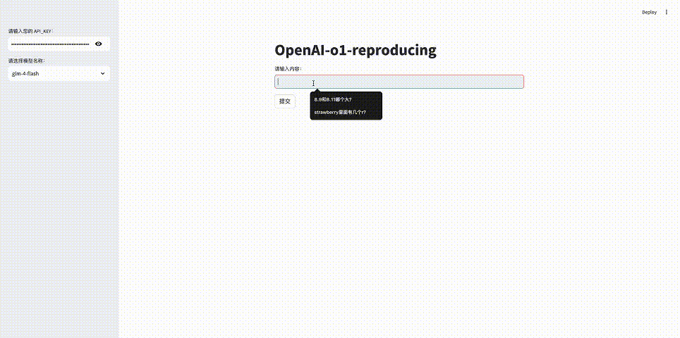

# OpenAI o1 模型思考效果复现

本项目旨在通过简单的系统整合，复现 OpenAI o1 模型的思考过程和效果。通过使用不同的提示和模型，我们可以模拟模型的思考步骤，为用户提供更深入的回答。

## 项目简介

本项目通过集成大型语言模型（LLM），如 GLM-4-Flash 和 Qwen2-7B-Instruct，模拟 OpenAI o1 模型的思考过程。借助 Streamlit，我们为用户提供了一个交互式的界面，可以体验模型的思考步骤和最终答案生成过程。

## 示例视频


## 功能特性

- **多模型支持**：支持 GLM-4-Flash 和 Qwen2-7B-Instruct 模型，方便用户根据需求选择。
- **思考过程展示**：实时展示模型的思考步骤，包括思考方向、分析与结论、反思等。
- **最终答案生成**：基于思考过程，生成详细的最终答案，并以 Markdown 格式呈现。
- **交互式界面**：使用 Streamlit 构建用户界面，方便用户输入问题并查看模型响应。

## 环境依赖

- Python 3.7 或更高版本
- 必要的 Python 库

## 安装与运行

### 1. 克隆仓库

首先，将本仓库克隆到本地：

```bash
git clone https://github.com/chensnathan/LLMo1Wrapper.git
cd LLMo1Wrapper
```

### 2. 安装依赖

安装所需的 Python 库：

```bash
pip install openai streamlit
```

### 3. 获取 API 密钥

由于需要调用模型 API，请按照以下步骤获取您的 API 密钥：

1. **GLM-4-Flash 模型**：

   - 访问 [智谱AI开放平台](https://open.bigmodel.cn/) 注册账户。
   - 进入控制台，获取您的 API Key。

2. **Qwen2-7B-Instruct 模型**：

   - 访问 [硅基流动](https://cloud.siliconflow.cn) 注册账户。
   - 进入控制台，并获取相应的 API Key。

**注意**：请妥善保管您的 API 密钥，不要泄露给他人。

### 5. 运行应用程序

在项目根目录下，运行 Streamlit 应用程序：

```bash
streamlit run app.py
```

在浏览器中访问显示的本地地址（通常是 `http://localhost:8501`），即可看到应用程序界面。

## 使用指南

1. **输入 API 密钥**：在应用程序的侧边栏，输入您获取的 API 密钥。

2. **选择模型**：从下拉菜单中选择您想使用的模型（如 `glm-4-flash` 或 `Qwen/Qwen2-7B-Instruct`）。

3. **输入问题**：在主界面的文本框中输入您的问题。

4. **提交问题**：点击 “提交” 按钮，模型将开始思考并生成答案。

5. **查看思考过程**：在 “显示思考过程” 的扩展栏中，您可以实时查看模型的思考步骤。

6. **查看最终答案**：在页面下方，模型将以 Markdown 格式展示最终的答案。

## 代码结构

- `llms/`：包含对不同模型的封装，如 `GLM4LLM` 和 `Qwen2LLM` 类。

- `llm_o1_wrapper.py`：`o1Wrapper` 类，实现了模型的思考、回答、反思、判断和最终答案生成等功能。

- `app.py`：Streamlit 应用程序的入口，构建了用户界面，并调用 `o1Wrapper` 生成响应。

## 示例

**示例问题**：

```
8.9和8.11谁更大？
```

**使用步骤**：

1. 在侧边栏输入您的 API 密钥。

2. 选择模型（例如 `glm-4-flash`）。

3. 在文本框中输入上述问题。

4. 点击 “提交” 按钮。

5. 在 “显示思考过程” 中，您将看到模型的思考步骤，例如：

   - **思考方向**：比较小数大小的方法。
   - **分析与结论**：比较整数部分、比较小数部分、处理不同位数的小数。
   - **反思**：提供的回答内容基本上是合理的。

6. 最终，模型将生成详细的答案。
